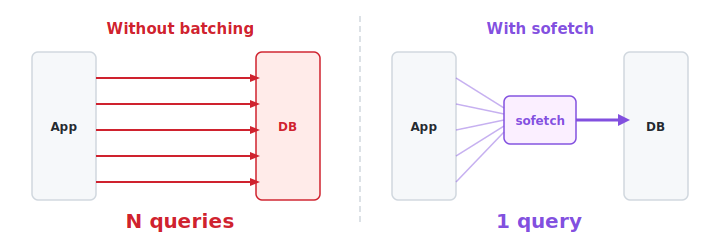
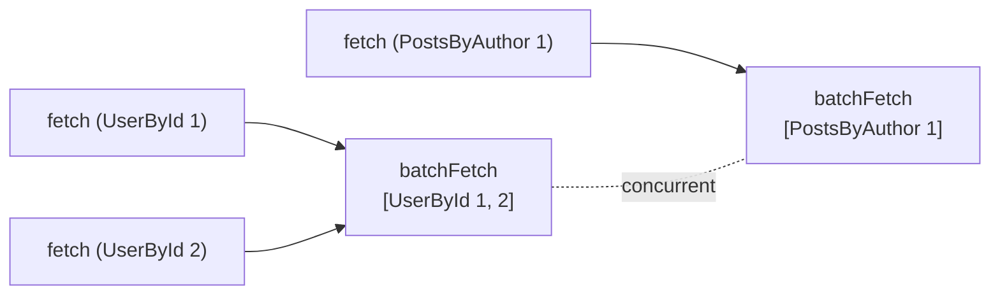
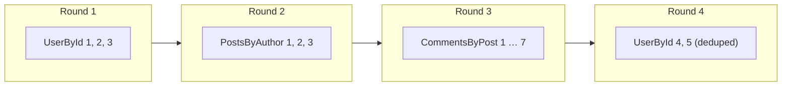
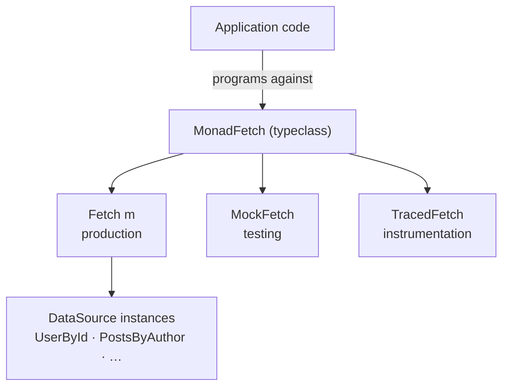

<p align="center">
  
</p>

<p align="center">
  
</p>

<p align="center">
  <a href="LICENSE"></a>
  
  
</p>

---

## The problem

Suppose you have a web page that shows a list of blog posts, each with its
author's name. A naive implementation fetches each author one at a time:

```haskell
-- Fetch each author individually, one query per post!
renderPosts :: [Post] -> AppM [Html]
renderPosts posts = forM posts $ \post -> do
  author <- getUser (postAuthorId post)    -- DB round-trip
  pure (renderPostCard post author)
```

Ten posts means ten separate database queries. A hundred posts means a
hundred queries. This is the **N+1 problem**: you run 1 query to get the
list, then N more queries to get each related item. It's one of the most
common performance pitfalls in data-access code, and it's easy to
introduce without noticing because each function in isolation looks
perfectly reasonable.

The typical fix is to restructure your code: collect all the
IDs up front, run a single batched query, then stitch the results back
together. That works, but it forces your code shape to match your
optimisation strategy. Composition suffers: you can't freely combine small
functions without worrying about the data-access pattern they produce.

## The solution

**sofetch** fixes this automatically. Write simple, sequential-looking
code, and sofetch batches and deduplicates your data access behind the
scenes:

```haskell
renderPosts :: (MonadFetch m n, DataSource m UserById) => [Post] -> n [Html]
renderPosts posts =
  -- All author fetches are batched into ONE query, automatically.
  fetchThrough (UserById . postAuthorId) posts
    <&> map (\(post, author) -> renderPostCard post author)
```

No matter how many posts you have, this issues a single `WHERE id IN (...)`
query for all the authors. You didn't have to restructure anything. You
wrote the obvious code and sofetch made it fast.

<p align="center">
  
</p>

This works across function boundaries too. If `renderPostCard` internally
fetches comment counts, and `renderSidebar` fetches the same authors for a
"top contributors" widget, sofetch merges all of those fetches together.
Functions that were written independently, without any knowledge of each
other, still get optimal batching when composed.

## How it works (in brief)

sofetch gives you a special `Fetch` monad. When you write:

```haskell
(,) <$> fetch (UserById 1) <*> fetch (UserById 2)
```

...the two fetches don't happen immediately. Instead, sofetch collects them
into a **round**, groups them by data source, and dispatches one batched
call per source. The `<*>` operator (or `ApplicativeDo` if you prefer
do-notation) is the signal that two fetches are independent and can be
batched together. The `>>=` operator (monadic bind) introduces a round
boundary: the right side depends on the left side's result, so it has to
wait.



Within each round:

- Keys for the **same data source** are grouped into one `batchFetch` call.
- Keys for **different data sources** run concurrently.
- **Duplicate keys** are deduplicated. The same key appearing in multiple
  places produces only one fetch, and all callers share the result.
- Results are **cached** so the same key never hits the database twice (unless
  you opt out).

## Quick start

### 1. Define key types

Each kind of data you want to fetch gets a **key type**, a small type that
says "I want to look up *this thing*" and declares what the result will be.
This is the core modelling step: one key type per query shape.

```haskell
{-# LANGUAGE DeriveGeneric, DeriveAnyClass, DerivingStrategies, TypeFamilies #-}

data User = User { userId :: Int, userName :: Text }
data Post = Post { postId :: Int, postAuthorId :: Int, postTitle :: Text }

-- "Give me a user by their ID"
newtype UserById = UserById Int
  deriving stock (Eq, Ord, Show, Generic)
  deriving anyclass (Hashable)

instance FetchKey UserById where
  type Result UserById = User

-- "Give me all posts by this author"
newtype PostsByAuthor = PostsByAuthor Int
  deriving stock (Eq, Ord, Show, Generic)
  deriving anyclass (Hashable)

instance FetchKey PostsByAuthor where
  type Result PostsByAuthor = [Post]
```

The key type carries the query parameter (the user ID, the author ID) and
the `FetchKey` instance tells sofetch what type the answer will be. All the
required instances (`Eq`, `Hashable`, `Show`, etc.) are stock-derivable, no
boilerplate.

### 2. Teach sofetch how to fetch them

A `DataSource` instance tells sofetch how to batch-fetch a group of keys.
You receive a `NonEmpty` list of keys and return a `HashMap` of results,
one entry per key:

```haskell
instance DataSource AppM UserById where
  batchFetch keys = do
    pool <- asks appPool
    let ids = [uid | UserById uid <- toList keys]
    rows <- liftIO $ withResource pool $ \conn ->
      query conn "SELECT id, name FROM users WHERE id = ANY(?)" (Only ids)
    pure $ HM.fromList [(UserById (userId u), u) | u <- rows]
```

The `AppM` parameter is *your* monad. If it has access to a connection
pool, config, or anything else, your data source has access to it too.
No special environment setup is needed.

If your backend doesn't support batch lookups (e.g. a REST API that only
fetches one item at a time), implement `fetchOne` instead. sofetch will
call it for each key:

```haskell
instance DataSource AppM UserById where
  fetchOne (UserById uid) = lookupUserById uid
```

You still get deduplication and caching; you just don't get the batched
SQL.

### 3. Write data-access code

Now use `fetch` in your application code. Program against the `MonadFetch`
typeclass so your functions work with any implementation (production, tests,
tracing):

```haskell
getUserFeed :: (MonadFetch m n, DataSource m UserById, DataSource m PostsByAuthor)
            => Int -> n (User, [Post])
getUserFeed uid =
  (,) <$> fetch (UserById uid) <*> fetch (PostsByAuthor uid)
```

These two fetches are independent (`<*>`), so sofetch batches them into a
single round. If you prefer do-notation, enable `ApplicativeDo` and write
the equivalent:

```haskell
{-# LANGUAGE ApplicativeDo #-}

getUserFeed uid = do
  user  <- fetch (UserById uid)        -- batched together
  posts <- fetch (PostsByAuthor uid)   -- in one round
  pure (user, posts)
```

Both forms produce identical batching behaviour.

### 4. Run it

```haskell
handleRequest :: AppEnv -> Int -> IO (User, [Post])
handleRequest env uid = runAppM env $ do
  cfg <- fetchConfigIO
  runFetch cfg (getUserFeed uid)
```

`fetchConfigIO` works for any `MonadUnliftIO` monad (which includes any
`ReaderT env IO` stack, the most common pattern). It wires everything up
automatically.

### 5. Test it

Swap the real data sources for canned data. No IO, no database:

```haskell
testGetUserFeed :: IO ()
testGetUserFeed = do
  let mocks = mockData @UserById       [(UserById 1, testUser)]
           <> mockData @PostsByAuthor   [(PostsByAuthor 1, [testPost])]
  (user, posts) <- runMockFetch @AppM mocks (getUserFeed 1)
  assertEqual user testUser
  assertEqual posts [testPost]
```

Because `getUserFeed` is polymorphic over `MonadFetch`, it runs unchanged
against `MockFetch`. No special test wiring needed.

## A real example: collapsing N+1 cascades

Here's a scenario from the included SQLite example. A blog page needs to
render three authors, each with their posts, each post with its comments,
each comment with its author name. The functions are written independently
at four different levels:

```
renderBlogPage                    fetches 3 authors
  └─ renderAuthorProfile          fetches posts for an author
       └─ renderPostWithComments  fetches comments for a post
            └─ renderComment      fetches the comment's author
```

Without sofetch, this is 25+ database queries. With sofetch, `traverse`
automatically merges fetches at the same depth:



**4 rounds, 4 SQL queries**, regardless of the data size. The functions
never coordinate with each other. They don't know they're being composed.
sofetch handles it.

## Key features

- **No GADTs.** Data sources are ordinary typeclasses. Key types use stock
  `deriving`. If you've defined a newtype, you're 90% of the way to a data
  source.
- **Your monad, your resources.** `DataSource` is parameterised by your
  monad, not some framework environment. Connection pools, config, whatever
  your monad carries, your data sources have access to it. Missing
  instances are compile-time errors, not runtime crashes.
- **Monad transformer.** `Fetch m a` layers over your existing monad stack.
  Drop it in without restructuring your application.
- **Swappable implementations.** `MonadFetch` is the interface your
  application code uses. Production, test, and traced implementations all
  satisfy it. Swap without code changes.
- **Extensible instrumentation.** `runLoopWith` lets you wrap each batch
  round (e.g. with tracing spans). OpenTelemetry support lives in the
  separate [`sofetch-otel`](./sofetch-otel) package.



## Combinators

sofetch includes a toolkit for common patterns:

| Combinator | What it does |
|---|---|
| `fetchAll keys` | Fetch a list of keys in one round |
| `fetchThrough toKey items` | Extract a key from each item, fetch, pair back |
| `fetchMap toKey combine items` | Like `fetchThrough` but transform the pair |
| `fetchMaybe maybeKey` | Fetch if the key is present |
| `fetchMapWith keys` | Fetch a collection, return a `HashMap` of results |
| `filterA predicate items` | Applicative filter; all predicates batched |
| `withDefault val action` | Return a default on any exception |
| `pAnd` / `pOr` | Parallel short-circuiting boolean combinators |

## Advanced usage

### Shared cache across phases

To preserve the cache across sequential computations, use `runFetch'` which
returns the cache alongside the result:

```haskell
handleTwoPhases :: AppEnv -> IO [Post]
handleTwoPhases env = runAppM env $ do
  cfg <- fetchConfigIO

  -- Phase 1: populate cache
  (_users, cache) <- runFetch' cfg $
    fetchAll [UserById 1, UserById 2, UserById 3]

  -- Phase 2: cached keys resolve without hitting the DB
  runFetch cfg { configCache = Just cache } $
    fetchAll [PostsByAuthor 1, PostsByAuthor 2]
```

### Restricted monads (no MonadIO)

For monads that deliberately hide IO (e.g. a `Transaction` type that
prevents arbitrary IO inside database transactions), use `fetchConfig` with
explicit natural transformations and export a safe runner:

```haskell
fetchInTransaction :: Fetch Transaction a -> Transaction a
fetchInTransaction = runFetch (fetchConfig unsafeRunTransaction unsafeLiftIO)
```

The unsafe escape hatches stay private to your DB module. Application code
calls `fetchInTransaction` and never touches IO.

See `examples/SqliteBlog.hs` (scenario 12) for a worked proof-of-concept.

## Examples

The `examples/` directory contains two runnable programs:

```bash
stack build --flag sofetch:examples
stack exec sqlite-blog
stack exec github-explorer
```

**SQLite blog** (`examples/SqliteBlog.hs`): A blog platform backed by
in-memory SQLite. Every `batchFetch` prints its SQL so you can see exactly
how fetches are batched. Covers applicative batching, N+1 avoidance,
deduplication, deep N+1 across function boundaries, faceted queries, chunked
batching, shared caches, mocks, and restricted monads.

**GitHub explorer** (`examples/GitHubExplorer.hs`): Concurrent exploration
of the GitHub REST API. Demonstrates sofetch with HTTP backends where the
value is concurrency, deduplication, and caching rather than SQL batching.

## Packages

| Package | Description |
|---|---|
| **sofetch** | Core library: `Fetch`, `DataSource`, `MonadFetch`, cache, engine, mocks, tracing hooks |
| **[sofetch-otel](./sofetch-otel)** | OpenTelemetry instrumentation via `runFetchWithOTel` |

## Modules

| Module | Contents |
|---|---|
| `Fetch` | Top-level re-exports |
| `Fetch.Class` | `FetchKey`, `DataSource`, `MonadFetch`, `MonadFetchBatch`, `Status`, `Batches` |
| `Fetch.Batched` | `Fetch` monad transformer, runners, `runLoopWith` |
| `Fetch.Engine` | Batch dispatch with strategy-based scheduling |
| `Fetch.Cache` | IVar-based cache with dedup, eviction, warming |
| `Fetch.IVar` | Write-once variable with error support |
| `Fetch.Combinators` | `fetchAll`, `fetchThrough`, `fetchMap`, etc. |
| `Fetch.Mock` | `MockFetch` for testing |
| `Fetch.Traced` | `TracedFetch` with per-round callbacks |
| `Fetch.Mutate` | `Mutate` for interleaved read-write computations |
| `Fetch.Memo` | `MemoStore`, `memo`, `memoOn` |
| `Fetch.Deriving` | Helpers for writing instances (`optionalBatchFetch`, DerivingVia docs) |

## Design

See [docs/DESIGN.md](./docs/DESIGN.md) for the full set of design decisions
and tradeoffs.

---

<sub>sofetch is inspired by Facebook's [Haxl](https://github.com/facebook/Haxl)
(Marlow et al., *There is no fork: an abstraction for efficient, concurrent,
and concise data access*, ICFP 2014). It keeps the core idea (write
sequential-looking code, get batched data access) while replacing the
GADT-based data source API with type families and ordinary typeclasses, and
using a monad-transformer design instead of a bespoke environment. See
[DESIGN.md](./docs/DESIGN.md) for a detailed comparison.</sub>
